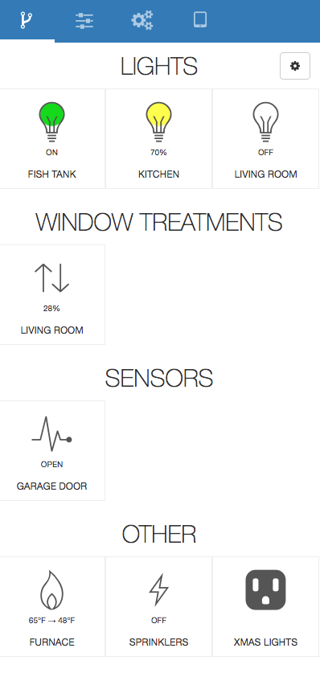
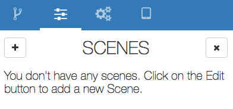
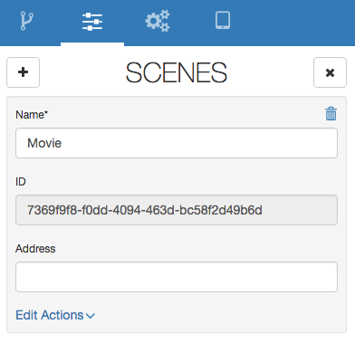
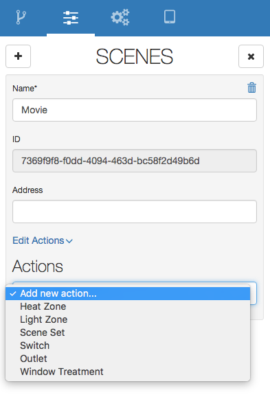
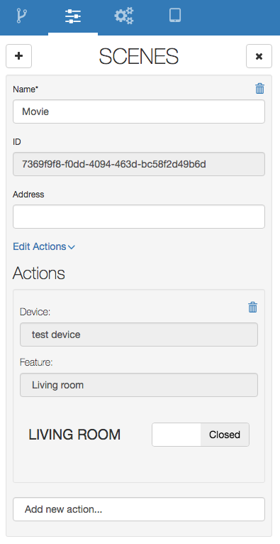

##What does goHOME do?
The tl;dr for goHOME is that it enables you to monitor and control many pieces of home automation hardware through once common user interface. It also allows you to extend the functionality of various pieces of hardware with new features not supported by the original hardware manufacturers, such as scheduling, interop between different pieces of hardware (when my lutron lights turn on, set my Philips hue lights to 50%).

##Installing goHOME
Since goHOME is controlling devices in your home, you need to have the app running 24/7.  You can install the app on any computer architecture that is supported by the go programming language: https://golang.org/dl/

IMPORTANT: goHOME requires go 1.7 or above, if you have an older version you will need to update to 1.7 or newer.

###Raspberry PI
Raspberry PI is a cheap PC (around $25) that is popular for home automation, if you want to install goHOME on a Raspberry PI [here](raspberrypi_manual.md) are some detailed instructions.

###Other systems
If you want to install goHOME on other systems, Mac, PC etc. then you will need to ...
//TODO:

##Adding hardware to your system
To see a list of the currently supported hardware, go here 

//TODO: If the hardware you own isn't supported, you can either try to add it yourself.

##Features
A feature is a piece of functionality that a hardware device supports. Currently supported feature types are:

  - Lights
  - Outlets
  - Switches
  - Heat (furnace control)
  - Window Treatments (shades, curtains)
  - Sensors

A device may have one or more features, for example the Belkin WeMo Maker device has a switch that you can turn on/off and also a sensor that has a open/closed state. So if we imported that piece of hardware we would see two features listed in the UI.  Below is an example screen showing the features tab with various features

Once you have setup your system and have some features, simply click on the feature in the UI to expose the control panel, from here you can control your system. For example, below we click on the kitchen lights feature and set the intensity of the lights to 72%

##Backing up your system
Once you have imported devices and configured your system, you will want to make a copy of the system config file. It is good practise to make a backup before you add new hardware incase something goes wrong or you make changes you are unhappy with. 

By default goHOME stores your system configuration in a file called gohome.json in the same directory where the gohome executable is located. If you want to change the location of the system file you can modify the [config](docs/config.md) file.

##Adding Scenes
A scene is simply a group of actions that should be executed when the user activates the scene, for example, a movie scene might execute the following commands:
  - Turn off all lights in the living room
  - Close shades in the living room
  - Set lights over the TV to 5% brightness

To add a new scene, click on the Scenes tab, by default it enters edit mode when you don't have any scenes, click on the "+" button on the top left to start adding a scene

You will see a new scene form, enter the name, this is required, the address field is optional. IF you are importing scenes from 3rd party hardware sometimes they require an address, for now leave it blank and hit the save button

Now we can define the actions, a scene can have as many actions as you want, click on the "actions" link and select the type of feature you want to control e.g. Light, outlet, window treatment

Next you choose the device and feature you want to control, in this example we choose the living room shade and set it to a closed state, then hit the save button to save the command

Next, click on the "Add new action..." option and we choose the kitchen lights and set them to 10% so we can still grab some food during a movie

That's it, now you can exit the edit scene mode by scrolling back to the top and hitting the "X" button in the top right. You will now see a list containing the scene you just created, click on it to expand the scene information, you can then hit the "Activate" button to run the scene.

##Creating automation
Automation allows you to define actions that should run under certain conditions, for example, at sunset close all my window shades, or if I triple tap a certain light switch turn off all the lights in my house, or every day at 4pm turn on my garden sprinklers.

To get started creating some automation, follow the steps in [this](docs/automation.md) document.

##TODO:
  - Connecting to goHOME remotely
  - Upgrading gohome
  - Update config docs, updating file requies reboot of gohome executable
  - Supported Hardware
  - FAQ delete
  - Device stops working (belkin), changes address, port
